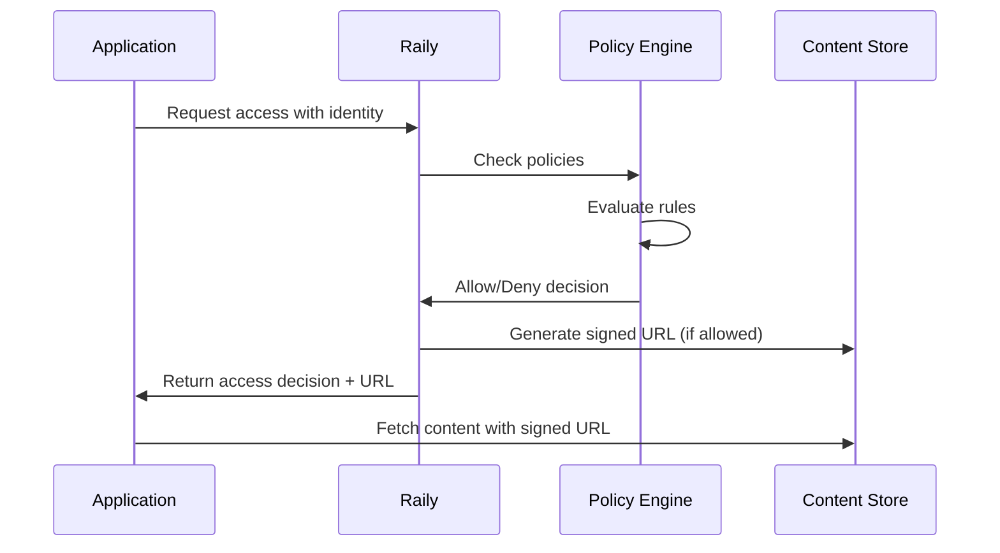

## Overview

Raily provides a comprehensive identity and authentication system that ensures every access to your content is properly authenticated and authorized. This system tracks who (or what) is accessing your data and enforces your access policies.

## Identity Types

Raily supports multiple identity types to cover all access scenarios:

<CardGroup cols={2}>
  <Card title="AI Servers" icon="robot">
    LLM providers, AI applications, and autonomous agents
  </Card>
  <Card title="Organizations" icon="building">
    Companies and institutions accessing your content
  </Card>
  <Card title="Applications" icon="window">
    Your own applications and services
  </Card>
  <Card title="End Users" icon="user">
    Individual users consuming AI-powered services
  </Card>
</CardGroup>

## Authentication Methods

### API Key Authentication

The primary authentication method for programmatic access:

```javascript
import Raily from '@raily/sdk';

const raily = new Raily({
  apiKey: process.env.RAILY_API_KEY
});

// API key is automatically included in all requests
const access = await raily.access.check({
  contentId: "cnt_article_123",
  requesterId: "app_customer_portal"
});
```

### OAuth 2.0 Integration

For applications requiring user-level authentication:

```javascript
// Configure OAuth for your application
await raily.auth.configureOAuth({
  clientId: process.env.OAUTH_CLIENT_ID,
  clientSecret: process.env.OAUTH_CLIENT_SECRET,
  redirectUri: "https://yourapp.com/auth/callback",
  scopes: ["content.read", "analytics.view"]
});

// Exchange authorization code for access token
const tokens = await raily.auth.exchangeCode({
  code: authCode,
  redirectUri: "https://yourapp.com/auth/callback"
});

// Use access token for authenticated requests
const railyWithToken = new Raily({
  accessToken: tokens.access_token
});
```

### White Label Authentication

Use your existing authentication system with Raily:

```javascript
// Configure custom authentication provider
await raily.auth.configureWhiteLabel({
  provider: "custom",
  authEndpoint: "https://auth.yourcompany.com/verify",
  publicKey: process.env.JWT_PUBLIC_KEY
});

// Raily will verify tokens against your auth system
const access = await raily.access.check({
  contentId: "cnt_doc_456",
  customToken: userJWT
});
```

## Identity Management

### Creating Identities

```javascript
// Create an application identity
const appIdentity = await raily.identities.create({
  type: "application",
  name: "Customer Portal",
  metadata: {
    environment: "production",
    owner: "engineering@company.com"
  }
});

// Create an organization identity
const orgIdentity = await raily.identities.create({
  type: "organization",
  name: "Acme Corporation",
  metadata: {
    industry: "technology",
    size: "enterprise"
  }
});
```

### Identity Attributes

Assign attributes to identities for fine-grained access control:

```javascript
// Add attributes to an identity
await raily.identities.addAttributes({
  identityId: appIdentity.id,
  attributes: {
    subscription_tier: "enterprise",
    features: ["api_access", "bulk_download"],
    region: "us-east-1"
  }
});

// Use attributes in access policies
const policy = await raily.policies.create({
  name: "Enterprise Access",
  rules: [{
    action: "allow",
    conditions: {
      "identity.attributes.subscription_tier": "enterprise"
    },
    permissions: ["full_access"]
  }]
});
```

## Authorization Flow

Understanding how Raily authorizes access:



## Token Management

### Access Tokens

```javascript
// Generate short-lived access token
const token = await raily.auth.generateToken({
  identityId: appIdentity.id,
  scope: ["content.read"],
  expiresIn: 3600 // 1 hour
});

// Use token for requests
const response = await fetch(
  `https://api.raily.ai/content/${contentId}`,
  {
    headers: {
      Authorization: `Bearer ${token.access_token}`
    }
  }
);
```

### Refresh Tokens

```javascript
// Request with refresh token capability
const tokens = await raily.auth.generateTokenPair({
  identityId: appIdentity.id,
  scope: ["content.read"],
  includeRefreshToken: true
});

// Later, refresh the access token
const newTokens = await raily.auth.refreshToken({
  refreshToken: tokens.refresh_token
});
```

## Multi-Factor Authentication

Enable MFA for sensitive operations:

```javascript
// Enable MFA for an identity
await raily.identities.enableMFA({
  identityId: appIdentity.id,
  method: "totp", // Time-based one-time password
  backupCodes: true
});

// Verify MFA during authentication
const access = await raily.access.check({
  contentId: "cnt_sensitive_data",
  requesterId: appIdentity.id,
  mfaCode: userProvidedCode
});
```

## Session Management

Track and manage active sessions:

```javascript
// List active sessions for an identity
const sessions = await raily.identities.sessions({
  identityId: appIdentity.id,
  status: "active"
});

// Revoke a specific session
await raily.identities.revokeSession({
  sessionId: sessions[0].id,
  reason: "security_audit"
});

// Revoke all sessions (force re-authentication)
await raily.identities.revokeAllSessions({
  identityId: appIdentity.id
});
```

## Identity Federation

Connect external identity providers:

```javascript
// Configure SAML integration
await raily.auth.configureSAML({
  entityId: "https://idp.company.com",
  ssoUrl: "https://idp.company.com/sso",
  certificate: samlCertificate,
  attributeMapping: {
    email: "emailAddress",
    name: "displayName",
    groups: "memberOf"
  }
});

// Configure OIDC (OpenID Connect)
await raily.auth.configureOIDC({
  issuer: "https://auth.company.com",
  clientId: process.env.OIDC_CLIENT_ID,
  clientSecret: process.env.OIDC_CLIENT_SECRET
});
```

## Audit Logging

Track all authentication events:

```javascript
// Query authentication logs
const logs = await raily.auth.auditLogs({
  identityId: appIdentity.id,
  eventTypes: ["login", "token_generated", "access_denied"],
  startDate: "2024-01-01",
  endDate: "2024-01-31"
});

// Example log entry
logs.forEach(log => {
  console.log(`${log.timestamp}: ${log.event_type}`);
  console.log(`  Identity: ${log.identity_id}`);
  console.log(`  IP: ${log.ip_address}`);
  console.log(`  Result: ${log.result}`);
});
```

## Best Practices

<CardGroup cols={2}>
  <Card title="Principle of Least Privilege" icon="key">
    Grant identities only the minimum permissions needed for their function.
  </Card>
  <Card title="Regular Key Rotation" icon="rotate">
    Rotate API keys and tokens regularly, especially for production systems.
  </Card>
  <Card title="Monitor Authentication" icon="eye">
    Set up alerts for unusual authentication patterns or failed attempts.
  </Card>
  <Card title="Secure Storage" icon="vault">
    Store credentials securely using environment variables or secret managers.
  </Card>
</CardGroup>

## Security Considerations

```javascript
// Example: Secure authentication pattern
async function secureAccess(contentId, userId) {
  try {
    // 1. Verify user session
    const session = await verifyUserSession(userId);

    // 2. Check access with Raily
    const access = await raily.access.check({
      contentId: contentId,
      requesterId: session.identityId,
      context: {
        ip: session.ipAddress,
        userAgent: session.userAgent,
        purpose: "user_access"
      }
    });

    // 3. Audit the access attempt
    await raily.audit.log({
      event: "content_access",
      identityId: session.identityId,
      contentId: contentId,
      result: access.allowed ? "granted" : "denied"
    });

    return access;
  } catch (error) {
    // Log security errors
    await raily.audit.logError({
      error: error.message,
      identityId: userId
    });
    throw error;
  }
}
```

## Next Steps

<CardGroup cols={2}>
  <Card title="AI Servers" icon="robot" href="/concepts/ai-servers">
    Learn about registering and managing AI servers
  </Card>
  <Card title="Access Policies" icon="shield-check" href="/guides/access-policies">
    Configure fine-grained access control
  </Card>
</CardGroup>
