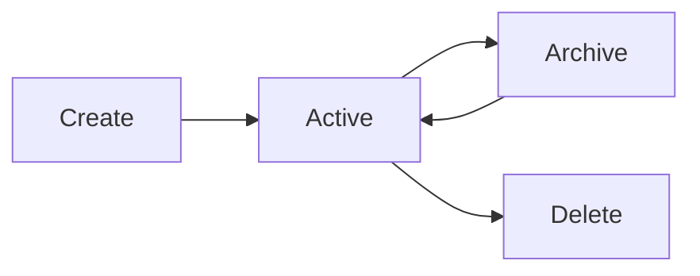
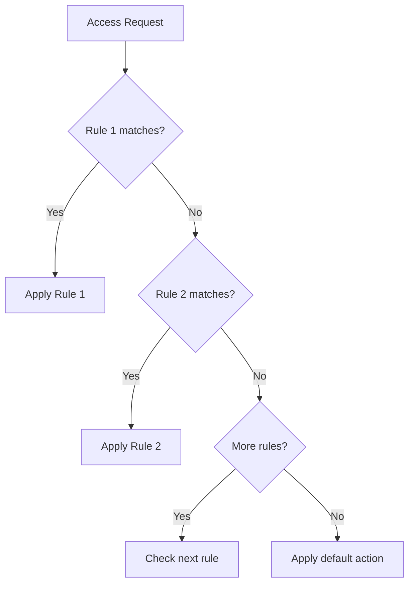
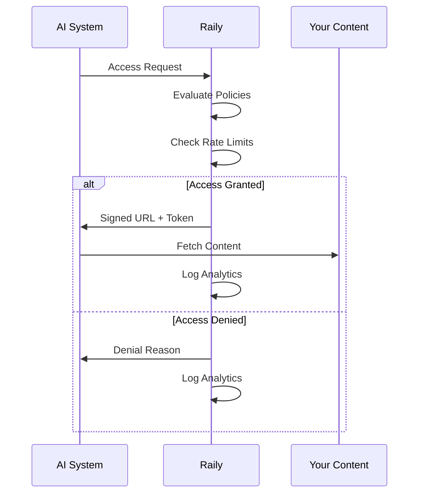

## Overview

Raily is built around four core concepts that work together to give you complete control over your content in the AI era:

<CardGroup cols={2}>
  <Card title="Content" icon="file-lines">
    Your articles, documents, images, and other digital assets
  </Card>
  <Card title="Policies" icon="shield">
    Rules that control who can access your content and how
  </Card>
  <Card title="Access Requests" icon="key">
    When AI systems request permission to use your content
  </Card>
  <Card title="Analytics" icon="chart-line">
    Insights into how your content is being used
  </Card>
</CardGroup>

---

## Content

Content is the foundation of Raily. It represents any digital asset you want to protect and monetize.

### Content Structure

Every piece of content in Raily has:

| Field | Description | Example |
|-------|-------------|---------|
| `id` | Unique Raily identifier | `cnt_abc123xyz` |
| `externalId` | Your internal identifier | `article-456` |
| `title` | Human-readable name | "Q4 Market Report" |
| `type` | Content category | `article`, `report`, `image` |
| `source` | Original location | `https://example.com/...` |
| `metadata` | Custom attributes | Author, date, tags |
| `policyId` | Applied access policy | `pol_xyz789` |

### Content Types

Raily supports various content types, each optimized for different use cases:

<AccordionGroup>
  <Accordion title="Articles & Blog Posts" icon="newspaper">
    Text-based content like news articles, blog posts, and editorial content.

    ```javascript
    const article = await raily.content.create({
      type: "article",
      title: "Breaking: AI Regulation Update",
      source: "https://news.example.com/ai-regulation",
      metadata: {
        author: "John Doe",
        section: "Technology",
        publishedAt: "2024-01-20T10:00:00Z"
      }
    });
    ```
  </Accordion>

  <Accordion title="Research & Reports" icon="file-chart-column">
    Long-form documents like research papers, whitepapers, and industry reports.

    ```javascript
    const report = await raily.content.create({
      type: "report",
      title: "2024 AI Industry Analysis",
      source: "https://research.example.com/ai-2024.pdf",
      metadata: {
        pages: 150,
        price: 499,
        category: "Premium Research"
      }
    });
    ```
  </Accordion>

  <Accordion title="Images & Media" icon="image">
    Visual content including photos, illustrations, and graphics.

    ```javascript
    const image = await raily.content.create({
      type: "image",
      title: "Product Photography - Series A",
      source: "https://cdn.example.com/photos/product-a.jpg",
      metadata: {
        resolution: "4000x3000",
        license: "commercial",
        photographer: "Jane Smith"
      }
    });
    ```
  </Accordion>

  <Accordion title="Datasets" icon="database">
    Structured data collections for AI training and analysis.

    ```javascript
    const dataset = await raily.content.create({
      type: "dataset",
      title: "Customer Sentiment Analysis Dataset",
      source: "s3://datasets/sentiment-v2.parquet",
      metadata: {
        records: 1000000,
        features: ["text", "sentiment", "confidence"],
        version: "2.0"
      }
    });
    ```
  </Accordion>
</AccordionGroup>

### Content Lifecycle



<Steps>
  <Step title="Create">
    Register content with Raily via API or dashboard
  </Step>
  <Step title="Active">
    Content is available for access requests and policy enforcement
  </Step>
  <Step title="Archive">
    Temporarily disable access while preserving history
  </Step>
  <Step title="Delete">
    Permanently remove content and associated data
  </Step>
</Steps>

---

## Policies

Policies are the rules that govern how AI systems can access your content. They're powerful, flexible, and designed for complex real-world scenarios.

### Policy Structure

```javascript
{
  id: "pol_xyz789",
  name: "Enterprise Access Policy",
  description: "Controls access for enterprise AI partners",
  rules: [
    {
      action: "allow",
      priority: 1,
      conditions: { /* when this rule applies */ },
      permissions: [ /* what the requester can do */ ],
      rateLimit: { /* usage limits */ }
    },
    // ... more rules
  ],
  defaultAction: "deny"
}
```

### Rule Evaluation

Rules are evaluated in priority order. The first matching rule determines the outcome.



### Conditions

Conditions determine when a rule applies:

<Tabs>
  <Tab title="Identity">
    ```javascript
    conditions: {
      requesterId: ["partner_openai", "partner_anthropic"],
      requesterType: "ai_provider"
    }
    ```
  </Tab>
  <Tab title="License">
    ```javascript
    conditions: {
      hasValidLicense: true,
      licenseType: ["enterprise", "professional"],
      licenseExpiry: { after: "now" }
    }
    ```
  </Tab>
  <Tab title="Usage">
    ```javascript
    conditions: {
      purpose: ["training", "inference"],
      commercialUse: false
    }
    ```
  </Tab>
  <Tab title="Time">
    ```javascript
    conditions: {
      time: {
        after: "2024-01-01",
        before: "2024-12-31",
        daysOfWeek: ["monday", "friday"]
      }
    }
    ```
  </Tab>
</Tabs>

### Permissions

Permissions define what actions are allowed:

| Permission | Description |
|------------|-------------|
| `full_access` | Complete content access |
| `preview_only` | Limited preview (first 500 chars) |
| `metadata_only` | Access to metadata, not content |
| `commercial_use` | Can use in commercial applications |
| `training` | Can use for AI model training |
| `inference` | Can use for AI inference only |

### Rate Limiting

Control usage volume to prevent abuse and manage costs:

```javascript
rateLimit: {
  requests: 1000,      // Maximum requests
  period: "hour",      // Time window: minute, hour, day, month
  burst: 100,          // Allow short bursts above limit
  scope: "requester"   // Apply per requester or globally
}
```

### Policy Example: Tiered Access

```javascript
const tieredPolicy = await raily.policies.create({
  name: "Tiered Content Access",
  rules: [
    // Enterprise: Full access, high limits
    {
      action: "allow",
      priority: 1,
      conditions: { licenseType: "enterprise" },
      permissions: ["full_access", "commercial_use", "training"],
      rateLimit: { requests: 10000, period: "hour" }
    },
    // Professional: Full access, moderate limits
    {
      action: "allow",
      priority: 2,
      conditions: { licenseType: "professional" },
      permissions: ["full_access", "commercial_use"],
      rateLimit: { requests: 1000, period: "hour" }
    },
    // Basic: Preview only, low limits
    {
      action: "allow",
      priority: 3,
      conditions: { licenseType: "basic" },
      permissions: ["preview_only"],
      rateLimit: { requests: 100, period: "day" }
    },
    // Default: Deny all others
    {
      action: "deny",
      priority: 99,
      conditions: { default: true },
      message: "Please obtain a license to access this content"
    }
  ]
});
```

---

## Access Requests

When an AI system wants to use your content, it sends an access request. Raily evaluates the request against your policies and returns a decision.

### Request Flow



### Request Structure

```javascript
const request = await raily.access.check({
  contentId: "cnt_abc123",
  requesterId: "partner_openai",
  context: {
    purpose: "inference",
    model: "gpt-4",
    userAgent: "OpenAI-API/1.0",
    ipAddress: "192.168.1.1"
  }
});
```

### Response Types

<Tabs>
  <Tab title="Granted">
    ```javascript
    {
      allowed: true,
      contentUrl: "https://cdn.raily.ai/...",
      token: "ey...",
      expiresAt: "2024-01-20T11:00:00Z",
      permissions: ["full_access", "inference"],
      rateLimit: {
        remaining: 999,
        resetAt: "2024-01-20T11:00:00Z"
      }
    }
    ```
  </Tab>
  <Tab title="Denied">
    ```javascript
    {
      allowed: false,
      reason: "rate_limit_exceeded",
      message: "Hourly request limit reached",
      retryAfter: "2024-01-20T11:00:00Z"
    }
    ```
  </Tab>
</Tabs>

---

## Analytics

Raily provides comprehensive analytics to help you understand how your content is being used and optimize your monetization strategy.

### Key Metrics

<CardGroup cols={2}>
  <Card title="Request Volume" icon="arrow-up-right-dots">
    Total access requests, broken down by granted vs denied
  </Card>
  <Card title="Top Requesters" icon="ranking-star">
    Which AI systems are requesting your content most
  </Card>
  <Card title="Popular Content" icon="fire">
    Your most-requested content pieces
  </Card>
  <Card title="Revenue" icon="coins">
    Earnings from licensed access
  </Card>
</CardGroup>

### Usage Analytics

```javascript
const usage = await raily.analytics.usage({
  period: "30d",
  groupBy: "day"
});

// Returns:
{
  totalRequests: 45230,
  allowed: 42100,
  denied: 3130,
  uniqueRequesters: 15,
  byDay: [
    { date: "2024-01-01", requests: 1520, allowed: 1480, denied: 40 },
    { date: "2024-01-02", requests: 1610, allowed: 1550, denied: 60 },
    // ...
  ],
  topContent: [
    { id: "cnt_abc", title: "AI Report 2024", requests: 8500 },
    { id: "cnt_def", title: "Market Analysis", requests: 6200 }
  ],
  topRequesters: [
    { id: "partner_openai", requests: 25000 },
    { id: "partner_anthropic", requests: 12000 }
  ]
}
```

### Revenue Analytics

```javascript
const revenue = await raily.analytics.revenue({
  period: "30d",
  currency: "USD"
});

// Returns:
{
  totalRevenue: 15420.00,
  byLicenseType: {
    enterprise: 12000.00,
    professional: 3000.00,
    basic: 420.00
  },
  byContent: [
    { id: "cnt_abc", title: "AI Report 2024", revenue: 8500.00 },
    { id: "cnt_def", title: "Market Analysis", revenue: 4200.00 }
  ],
  growth: {
    vsLastPeriod: 0.15,  // 15% increase
    trend: "up"
  }
}
```

---

## Putting It All Together

Here's how these concepts work together in a real-world scenario:

<Steps>
  <Step title="Publisher Registers Content">
    A news publisher adds their premium articles to Raily
  </Step>
  <Step title="Publisher Creates Policy">
    They set up a policy allowing licensed AI partners to access content
  </Step>
  <Step title="AI System Requests Access">
    An AI company wants to use the articles for their chatbot
  </Step>
  <Step title="Raily Evaluates Request">
    Raily checks if the AI company has a valid license
  </Step>
  <Step title="Access Granted">
    If licensed, Raily provides secure access to the content
  </Step>
  <Step title="Analytics Recorded">
    Every access is logged for reporting and billing
  </Step>
  <Step title="Publisher Gets Paid">
    Based on usage, the publisher receives revenue
  </Step>
</Steps>

## Next Steps

<CardGroup cols={2}>
  <Card title="Content Ingestion" icon="upload" href="/guides/content-ingestion">
    Learn how to import your content at scale
  </Card>
  <Card title="Policy Templates" icon="file-code" href="/guides/access-policies">
    Start with pre-built policies for common scenarios
  </Card>
  <Card title="Analytics Deep Dive" icon="magnifying-glass-chart" href="/guides/analytics">
    Get the most from your analytics data
  </Card>
  <Card title="API Reference" icon="code" href="/api-reference/introduction">
    Explore the complete API documentation
  </Card>
</CardGroup>
